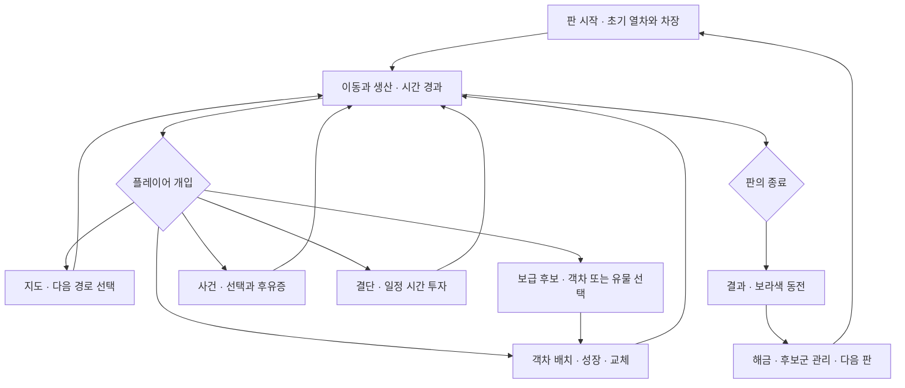

# 01. 플레이 루프와 시간

## 플레이를 이해하는 기본 단위

**공식 확인·화면 관찰:** 판 안에서는 열차가 이동하고, 객차가 생산하며, 지도에서 경로를 고르고, 보급·사건·결단을 처리한다. 판 밖에서는 해금과 다음 차장·난이도를 선택한다. [상점](https://store.steampowered.com/app/3690490/Frostrain_2/), [V01](10_OBSERVATION_LOG.md)

다음 도식은 확인한 기능의 **관계를 재구성한 해석**이다. 모든 사건이 거점에 도착해야 발생한다는 뜻은 아니다. 사건은 일수 기반으로 바뀐 공식 이력이 있다. [N070](11_SOURCES.md#n070)

## 시간은 하나의 타이머가 아니다

| 시간·진행 척도 | 보이는 역할 | 확인 수준 |
|---|---|---|
| 현실 시간·배속 | 플레이를 얼마나 빠르게 진행할지 결정 | SS00 등에 일시정지, 진행, ×2·×5·×10 버튼 관찰 |
| 객차 생산 사이클 | 승객이 들어가고 생산·훈련·추가 발동이 발생하는 기준 | 승객별 생산은 N066. 기본 길이는 현재 빌드 직접 검증 필요 |
| 게임 내 일수·시각 | 상단 날짜, 미래의 불만 표시, 일수 기반 성장·압력 | 공식 화면과 N070·N102의 생존 일수 보상 |
| 이동·도착 남은 시간 | 다음 지형이나 지점까지의 시간 표시 | SS00·SS01·V01 지도 |
| 결단 완료 시간 | 결단을 선택한 뒤 기다리는 투자 | SS07에 70초 등 표시 |
| 상태 지속·지연 발동 | 초당 손실, 일정 시간 후 보상, 임시 추가 선택 등 | SS05의 반발, N083·N086의 시간 효과 |

**미확인:** 과거 H01의 기본값은 사이클 10초·하루 30초지만, 이 값을 최신 빌드의 전역 상수로 채택하지 않았다. 배속·일시정지·화면 전환이 모든 타이머에 동일하게 적용되는지도 직접 확인하지 않았다. [H01](11_SOURCES.md)

**해석:** 생산이 반복되는 속도, 지도 진행 속도, 위험이 증가하는 속도를 분리하면 선택이 생긴다. 속도가 빠르면 다음 보상을 빨리 얻을 수 있지만 구간 내 생산 시간을 줄일 수 있다. 반대로 느리면 생산을 더 해도 일수 기반 압력을 더 오래 받을 수 있다. 어느 쪽이 유리한지는 위험 증가와 보상 구조에 달렸으므로 “빠른 열차가 항상 좋다”는 규칙으로 일반화하지 않는다.

## 자동 처리와 플레이어 처리

| 상황 | 자동으로 진행되는 것 | 플레이어가 읽고 결정하는 것 | 의미 있는 비용 |
|---|---|---|---|
| 평상시 이동 | 화면 배경·열차 이동, 생산·시간 경과 | 다음 위험까지 충분한지, 교체할 객차가 있는지 | 주의를 쓰는 시간, 잘못된 빌드를 유지하는 손실 |
| 보급 선택 | 후보 제시·선택 연출 | 지금 필요한 효과와 나중에 완성할 시너지 | 다른 후보를 포기, 필요하면 다시 뽑기 자원 |
| 객차 편성 | 선택한 편성이 생산에 반영 | 슬롯, 종류, 층, 위치, 보관할 후보 | 현재 생산과 장기 성장 사이의 교환 |
| 경로 선택 | 지정한 노선으로 이동 | 보상·랜드마크·거리·위험 | 추가 시간, 놓친 다른 경로의 보상 |
| 사건 | 조건에 따른 사건 제시 | 즉시 이득과 후유증, 캐릭터·사회 선택 | 자원 손실, 지속 상태, 선택하지 않은 결과 |
| 결단 | 진행 시간이 지난 뒤 효과 | 분기와 상호 배타성, 완료 시점 | 투자 시간, 다른 결단의 지연 |

보급 선택·교체·지도는 영상에서 확인한 행위다. 표의 “포기한 기회”는 분석용 비용이며 게임이 별도 자원으로 표시한다는 뜻은 아니다.

## 일시정지는 시스템의 일부다

중요한 변화는 선택지 수의 증가와 함께 **멈추는 조건도 추가됐다는 점**이다.

| 시점 | 공식 변경 | 줄이려는 부담에 대한 해석 |
|---|---|---|
| Demo 0.6.6 | 결단·상점 화면 자동 정지 | 긴 문장을 읽는 동안 생존 자원이 소모되는 부담 |
| 1.0.2 | 결단 완료 시 자동 정지 옵션 | 완료를 놓쳐 다음 선택이 늦어지는 부담 |
| 1.0.3 | 경로 없는 지점에 도착할 때 자동 정지 옵션 | 지도 전환·경로 선택을 제때 해야 하는 부담 |

출처: [N066](11_SOURCES.md#n066), [N102](11_SOURCES.md#n102), [N103](11_SOURCES.md#n103). 사건·보급·지도 등 **모든 화면의 정지 정책은 이 표만으로 확정할 수 없다.**

**해석:** 의사결정을 요구하는 실시간 게임도 숙고할 시간을 보장할 수 있다. 편안한 풍경과 촉박한 최적화를 동시에 넣으려면, 어려움을 “판단의 어려움”과 “빨리 눌러야 하는 어려움”으로 나누어야 한다. 자동 정지 옵션은 후자의 부담을 줄이는 장치다.

## 한 판의 단계별 분석

다음은 V01의 여러 시점을 묶은 **설계 해석**이다. 모든 차장·난이도·빌드의 진행이 같은 순서라는 뜻은 아니다.

### 초반: 생산이 가능한 최소 열차를 만들기

작은 슬롯 수, 적은 승객, 낮은 객차 성장으로 시작한다. 후보 하나의 즉시 생산이 중요하며, 이후 시너지를 위해 약한 객차를 유지할지 고민한다. V01 시작에는 행복 300, 승객 6, 배치 2/3이 보인다. 이는 **이 영상의 시작 상태**이며 모든 차장의 초기값이 아니다.

관찰할 질문은 “첫 선택이 나중의 빌드를 얼마나 제한하는가”, “잘못 고른 것을 교체할 기회가 있는가”, “최소 생산량에 못 미쳤을 때 회복 가능한가”다.

### 중반: 단일 객차보다 조합·누적 성장이 중요해지기

V01에서는 레벨과 객차 수가 늘고, 보급 카드와 유물, 결단 화면이 번갈아 나타난다. 이 단계에서는 더 높은 단일 산출이 시너지 임계치를 깨뜨릴 수 있고, 공간을 차지하는 성장 객차가 장기적으로 유리할 수 있다.

생산·성장·교체 선택의 이유를 설명할 수 있어야 빌드가 재미가 된다. 숫자가 커지기만 하고 고르는 기준이 그대로라면, 중반은 같은 행동을 오래 반복하는 구간이 된다.

### 후반: 성장 속도가 압력 증가를 따라가는지 확인하기

V01의 샘플에서는 41:00의 행복 33,908이 이후 감소하고, 48:40 결과 화면에서는 **일반 난이도 승리·53일 생존·남은 행복 447**이 보인다. 큰 숫자 자체가 지속적인 안전을 보장하지 않으면서도, 남은 여유로 목적지에 도달할 수 있다는 사례다. 그 감소의 원인을 특정 유물·차장 규칙 하나로 확정하지 않는다. 손실 항목과 선택의 연속 기록이 더 필요하다.

후반 설계의 질문은 “기존 빌드가 더 강해지는 것으로 해결되는가”, “다른 구성으로 전환해야 하는가”, “패배 전에 회복 기회가 보이는가”다. 성장과 압력의 차이를 설명하지 못하면 플레이어는 잘못된 선택보다 보이지 않는 요구량에 패배했다고 느낄 수 있다.

## 이동하는 열차라는 감각의 기능

**해석:** 같은 생산 판정도 움직이는 배경, 객차의 물리적 연결, 승객 아이콘, 도착 예고를 함께 보여 주면 “다음 장소로 가며 생활이 유지된다”는 의미를 가진다. 이동은 기다리는 시간에 맥락을 주고, 편성은 플레이어가 만든 공간을 화면에 남긴다.

우리 게임에 가져올 때 확인할 것은 주행 자체의 존재가 아니라 **주행 중에 보고 싶은 변화가 있는지**다. 화물이 늘고, 객차가 바뀌고, 목적지가 가까워지며, 선택한 경로의 풍경이 달라지는 정도가 작은 프로토타입의 주요 관찰 대상이 된다.
