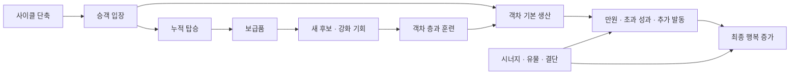

# 02. 객차와 시너지

## 객차를 어떤 데이터로 봐야 하는가

**화면 관찰:** 객차 카드에는 이름, 객차 그림, 색·테두리, 시너지 아이콘, 생산 설명, 성장 표시가 결합돼 있다. SS02의 대학과 사설 도박장은 단일 산출 외에 교육·아카데미 같은 분류를 보여 준다. 같은 객차가 여러 분류의 조합에 참여한다. [SS02](10_OBSERVATION_LOG.md)

원작을 연구하거나 비슷한 시스템을 구현할 때 다음 항목을 구분해야 한다. 이 표는 **분석용 데이터 분해**이며 원작 코드 구조를 확인한 결과가 아니다.

| 항목 | 의미 | 함께 기록해야 할 조건 |
|---|---|---|
| 객차 종류 | 이름과 기본 기능 | 언어별 이름, 기능을 바꾼 패치 |
| 시너지 분류 | 다른 객차와 임계치 효과를 구성 | 배치 상태의 개수인지, 예외가 있는지 |
| 품질·등급 | 카드 테두리·보상 단계 | 현재 레벨·후보 확률 |
| 층·업그레이드 | 같은 종류의 성장 단계 | 최대치, 병합·직접 강화 조건 |
| 기본 산출 | 승객 입장 등에 따른 생산 | 기본 행복인지 최종 행복인지 |
| 특별 발동 | 만원 보너스, 훈련, 확률 생산 등 | 발동 사건·주기·확률·중첩 규칙 |
| 위치 | 열차 앞뒤·이웃·홀짝에 따른 효과 | 기관차 포함 여부와 계산 기준 |
| 저장 상태 | 보관·배치·재활용 | 성장과 누적 카운터의 보존 여부 |

**미확인:** 전체 객차 수, 모든 등급별 통계, 최신 병합 공식은 이번 자료에서 완성하지 않았다. 오래된 공략의 전체 목록을 현재 데이터로 복제하면 거짓 정밀함이 된다.

## 슬롯·승객·층은 다른 제한이다

SS06에는 배치 11/11, 승객 32, 높은 다층 객차가 함께 보인다. **해석:** 슬롯이 늘면 종류와 시너지를 넓히기 쉽고, 승객이 늘면 생산 기회가 늘 수 있으며, 층을 올리면 같은 자리의 산출을 강화할 수 있다. 세 성장 축을 분리했기 때문에 “더 긴 열차”와 “더 높은 객차”가 다른 성장의 모습으로 표현된다.

슬롯이 남는 것과 승객이 충분한 것은 같지 않다. 객차의 만원 조건, 생산 순서, 승객 수에 따라 새 객차가 곧바로 효율적으로 작동하지 않을 수 있다. 현재 배분 규칙은 [Q03](11_SOURCES.md)의 직접 확인 대상으로 남겼다.

## 시너지의 기능별 분해

아래 분류는 공식 화면과 패치에서 확인한 이름·기능을 묶은 것이다. 각 시너지의 **현재 모든 단계**를 재현한 공략표는 아니다.

| 분류 | 확인한 설계 역할 | 플레이어에게 생기는 질문 | 주요 근거 |
|---|---|---|---|
| 교육 | 만원 보너스의 확률·크기 강화 | 인원과 객차 용량이 맞는가? | SS02, N080 |
| 식량 | 승객 수 확대 | 늘어난 인원이 산출로 이어지는가? 혼잡 비용은? | N080, N082 |
| 운송 | 운송 객차의 누적 탑승으로 보급품 생성 | 단기 보상보다 운용 시간을 확보할 것인가? | N085, N086, V01 00:30 |
| 언론 | 초과 성과 확률 강화 | 반복 발동·확률 효과와 결합할 것인가? | N080 |
| 오락 | 확률에 따른 큰 양·음의 산출 | 평균 산출보다 변동과 파산 위험을 감당할 수 있는가? | N084, N085 |
| 문화·치안 | 산출 강화와 단계별 수치 조정 | 몇 개를 모으는 것이 공간 대비 유리한가? | N082, N083 |
| 동력 | 누적 증가와 상한이 있는 강화 | 준비 시간이 남아 있는가, 상한에 도달했는가? | N082, N083 |
| 아카데미 | 강화 상한·주기적인 아카데미 객차 획득 | 새 객차를 성장·편성 재료로 어떻게 사용할 것인가? | SS02 |
| 총보급관리국 | 생산 사이클 단축 | 많은 주기 발동 효과의 공통 증폭기가 되는가? | N081, N082, N083 |
| 붉은 서리 기사단 | 훈련을 통한 누적 성장 | 언제 시작·전환하고 성장을 어떻게 배분할 것인가? | N070, N082, V01 00:30 |
| 엔진의 자녀들 | 선물·신앙과 관련된 보상 구조 | 무작위 보상을 받아들이며 필요한 조합을 얻을 것인가? | N073, N082, N083 |
| 그림자 상인회 | 주행거리 기반 전용 상점 | 선택 통제에 투자할 것인가, 이동과 자원을 어떻게 연결할 것인가? | N070, N073, N084 |
| 탐험가 연맹 | 탐험 기록에 따른 성장 | 지도 진행·경로가 빌드 성장에 어떤 가치를 주는가? | N080 |
| 연료와 망치 비밀결사 | 행복 생산의 추가 반복 | 반복 생산을 어떤 산출·확률 효과와 결합할 것인가? | SS08, N084 |

표의 효과 중 일부는 과거 변경 기록에서 기능의 존재를 확인한 것이다. 추가 반복이 다른 확률·보너스를 각각 다시 판정하는지와 연산 순서는 검증하지 않았다. 총보급관리국을 모든 판의 필수 시너지라고 선언하는 것도 리뷰의 주장과 규칙을 혼동하는 일이다.

## 수치를 확인한 대표 사례

| 항목 | 확인된 값 | 기준·주의 |
|---|---|---|
| 운송 2 / 3 / 4 | 탑승 누적 40 / 31 / 24마다 보급품 1 | N086의 최종 변경 값. V01 00:30 툴팁에서도 확인. 전체 승객 수가 아니라 운송 객차 입장 누적 |
| 교육 2 / 3 / 4 | 만원 보너스 ×3 / 항상 발생 / ×6 | N080, SS02. 단계 효과의 실제 합산 순서는 직접 검증 대상 |
| 언론 3 / 4 / 5 / 6 | 언론 객차의 초과 성과 확률 20 / 40 / 60 / 80%, 다른 객차 10 / 20 / 30 / 40% | N080. 다른 효과와의 합산·상한과 현재 난이도 전부를 직접 검증한 값은 아님 |
| 그림자 상점 칸 2 / 4 / 6 | 2 / 4 / 7칸 | N084. 상점 칸 수와 객차 슬롯 수는 구분 |
| 비밀결사 9 | 행복 생산 7회 추가 반복 | N084의 8회 추가→7회 추가 조정. 기본 1회까지 포함한 총 횟수와 추가 횟수를 구분 |
| 동력 4 / 5 누적 상한 | 30% / 45% | N083. 그 전의 35% / 55%에서 낮아짐 |
| 총보급관리국 6 | 사이클 -4초 | N082의 의도와 N083의 오류 수정. 다른 단축 효과·최솟값과의 결합은 미확인 |
| 오락 5 | 77% 확률 ×6, 14% 확률 음수 ×14 | N085. 나머지 경우·부호·기본 산출 조건 확인 없이 완전한 기대값을 계산하지 않음 |

이 표는 가장 최근에 찾은 **개별 항목의 공식 수치**와 화면 근거를 남긴 것이다. 마지막 언급이 오래됐다고 현재도 반드시 같다고 보증할 수는 없다.

## 빌드를 평가하는 순서

다음은 원작 규칙의 요약이 아니라 **설계·분석 절차**다.

1. 현재 생산을 유지할 수 있는지 본다. 장기 성장만 있고 즉시 산출이 없으면 전환 도중 위험하다.
2. 시너지 임계치 전후를 비교한다. 개별 객차의 산출 차이보다 조합 전체 변화가 클 수 있다.
3. 슬롯 한 자리의 가치와 승객 활용을 비교한다. 좋은 효과가 있어도 자원이 그 조건을 만족하지 못하면 무용하다.
4. 누적 성장에 필요한 시간을 확인한다. 늦게 얻은 성장 객차는 같은 성능이라도 남은 시간이 짧다.
5. 유물·결단이 어떤 발동 사건을 증폭하는지 본다. 행복 자체, 승객 입장, 반복 발동, 주행거리 등 기준이 다르다.
6. 교체할 때 사라지는 누적 효과를 확인한다. 현재 화면에서 즉시 계산되지 않는 손실일수록 미리 안내해야 한다.

## 조합이 강해지는 경로

이 도식은 **영향 관계**를 표현한다. 실제 엔진이 이 순서대로 산출을 계산한다는 뜻은 아니다. 효과의 연산 순서를 확인하려면 단일 객차로 조건을 하나씩 바꾸어야 한다.

**해석:** 반복 주기를 줄이는 기능은 다수의 효과를 동시에 강화할 수 있어 높은 결합 비용을 만든다. 특정 시너지가 여러 빌드의 공통 필수가 되면 덱의 다양성이 겉보기보다 작아질 수 있다. 확률 강화와 추가 발동도 함께 곱해질 수 있으므로 각각의 단독 밸런스만 검사해서는 부족하다.

## 개발자가 바꾼 최적화 행동

### 사례 A: 도착 직전 교체

초기에는 보급 획득 순간에만 필요한 객차를 배치해 혜택을 얻고 다시 생산 객차로 되돌리는 행동이 유리할 수 있었다. 운송은 이 문제를 줄이기 위해 **사용하는 동안 누적되는 탑승**으로 보급을 생성하도록 변경됐다. [N085](11_SOURCES.md#n085)

**해석:** 순간 검사보다 지속 운용의 누적을 보상하면, 같은 이득을 얻기 위해 해당 객차가 실제로 공간을 차지해야 한다. 단기 교체의 효율을 낮추고 편성에 의미 있는 기회비용을 부여한다.

### 사례 B: 높은 단계 하나에 몰아넣기

Demo 0.6.8에서는 높은 임계치에 몰려 있던 가치를 낮은 단계로 나누는 방향을 밝혔다. [N068](11_SOURCES.md#n068)

**해석:** 낮은 단계에도 가치가 있으면 서로 다른 분류를 섞는 선택이 가능해진다. 마지막 단계만 압도적으로 좋으면 결국 완성 조합 하나에 맞추는 행동으로 수렴한다. 다만 낮은 단계만 두루 모으는 것이 새 정답이 되지 않도록 각 단계의 목적도 달라야 한다.

### 사례 C: 후보 선택 통제의 겹침

개발자는 특정 조합 편중을 수정하면서 그림자 상점의 선택 통제와 엔진의 자녀들의 무작위 획득 사이에 역할 차이를 만들려 했다. [N073](11_SOURCES.md#n073)

**해석:** 두 보상 장치가 실질적으로 같은 일을 하고 한쪽이 더 싸면 선택이 사라진다. 무작위의 높은 잠재력, 선택의 안정성, 자원 비용을 비교하게 만들면 서로 다른 빌드의 기반이 될 수 있다.

## 객차 배치 시스템에서 아직 단정하지 않는 것

- 모든 객차가 위치에 민감하다고 쓰지 않는다. 위치 효과가 있는 유물·결단과 객차의 기본 규칙은 다르다.
- 카드 색을 층수와 같은 값으로 취급하지 않는다. 화면에는 품질과 업그레이드가 별도 표시된다.
- 병합이 항상 같은 층 두 장이며 완전히 되돌릴 수 있다고 쓰지 않는다. 과거 공략 정보는 직접 검증해야 한다.
- 게임이 특정 객체 순서로 모든 추가 발동을 처리한다고 추정하지 않는다.
- 큰 시너지 개수는 해당 판의 상태이며 그 수가 기본 최대치라는 증거가 아니다.

이 구분은 같은 시스템을 구현할 때도 유용하다. 기본 카드 정보, 성장 상태, 배치 조건, 발동 규칙을 분리하면 설명과 저장, 밸런스 수정이 서로 충돌하는 경우를 줄일 수 있다.
