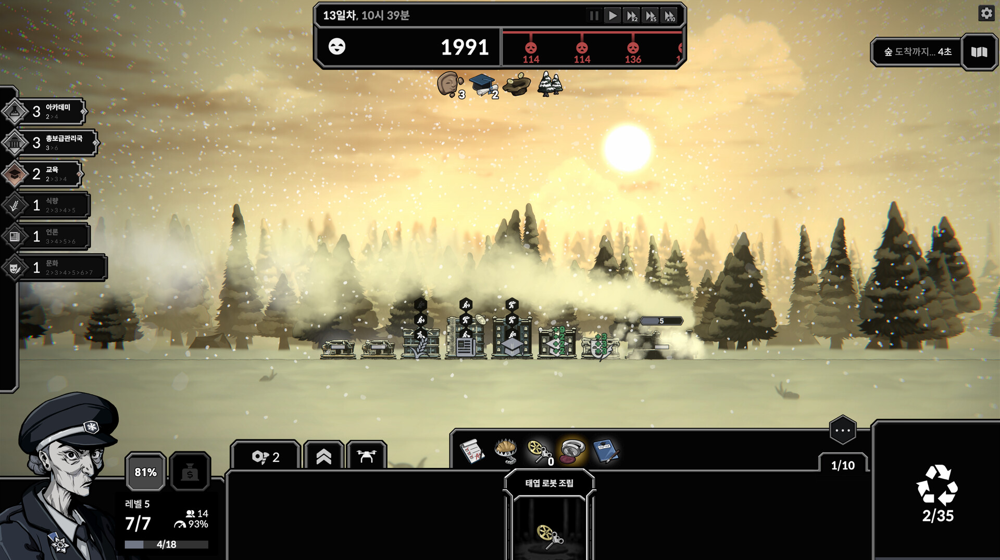

# 07. UI·미술·연출

## 주행 화면의 정보 배치

출처: 공식 Steam 스크린샷 SS01. 저장한 원본과 URL·해시는 [미디어 목록](data/official_media_index.json)에 있다. 이미지의 게임 빌드는 표시되지 않았다.

| 영역 | 화면 관찰 | 사용 목적에 대한 해석 |
|---|---|---|
| 상단 중앙 | 날짜·시각, 행복, 앞으로의 빨간 손실, 정지·배속 | 생존 여유와 가까운 위험을 계속 확인 |
| 상단 오른쪽 | 다음 지형 도착 시간, 지도 버튼 | 이동과 지도 의사결정을 연결 |
| 왼쪽 | 시너지 이름·현재 개수·다음 임계치 | 구성의 완성도와 다음 목표를 읽기 |
| 중앙 | 열차·사람·생산 수치·풍경 | 현재 빌드가 작동하는 모습을 확인 |
| 하단 왼쪽 | 차장·레벨·승객·속도·배치 슬롯·경험치 | 판의 성장 상태 |
| 하단 | 유물·손패와 재활용 | 구성 변경과 효과 확인 |

**해석:** 즉시 생존 정보는 상단, 주행의 감각은 중앙, 조작 후보는 하단에 놓여 있다. 많은 시스템을 한 화면에서 읽게 하는 장점이 있지만, 아이콘과 툴팁이 쌓이면 초반에는 위치만으로 뜻을 알기 어렵다.

## 객차 그림과 카드의 대응

SS01·SS03·SS06에서는 카드에 있는 객차 종류가 열차 위에 대응하고, 층이 높아진 객차와 생산 수치가 보인다. SS08에는 손패에 여러 보안관실이 있고, 편성의 시너지 개수가 왼쪽에 표시된다. [화면 기록](10_OBSERVATION_LOG.md)

**해석:** 내가 선택한 카드가 화면 속 공간이 된다는 연결이 중요하다. 객차를 바꿨을 때 카드 목록만 바뀌는 것보다, 열차의 모양과 생산 모습이 달라져야 소유감이 생긴다. 다층 객차는 숫자 강화에 공간적 형태를 준다.

한 종류의 그림을 층별로 반복한다고 모든 시각 비용이 사라지는 것은 아니다. 옆 객차 연결, 문·창문·승객의 위치, 증축의 실루엣, 작은 크기에서의 식별을 함께 정해야 한다.

## 작은 열차와 큰 풍경

공식 화면은 넓은 풍경 안에 작은 열차를 놓는다. 평원·숲·도시·터널 등의 배경, 눈과 빛, 따뜻한 색과 차가운 색의 변화가 관찰된다. [SS00·SS01·SS03·SS08](10_OBSERVATION_LOG.md), [N081](11_SOURCES.md#n081)

**해석:** 열차의 크기는 외부 세계의 규모와 고립을 강조한다. 이동 배경은 반복 생산의 대기 시간을 여행으로 해석하게 만든다. 배경만 많이 만들기보다 객차·사람·수치 변화가 같은 장면에서 읽히는지가 중요하다.

풍경이 아름다워도 생산을 자세히 읽기 어렵거나 반복해서 큰 선택 창이 덮으면 관찰의 흐름이 끊긴다. 주행 화면과 선택 화면의 비중은 같은 작품 안에서도 서로 경쟁할 수 있다.

## 사건 화면의 표현

SS05와 공개 영상의 사건 화면은 흑백 선화, 인물의 표정·포즈, 짧은 본문, 선택 버튼을 사용한다. 결단은 별도 트리 화면이고, 보급은 객차·유물 카드 비교 화면이다. **화면의 역할마다 표현 형식이 다르다.**

**해석:** 풍경은 이동의 분위기를, 사건 삽화는 인물과 사회의 문제를, 결단 트리는 계획을 담당한다. 모든 내용을 동일한 카드 선택으로 표현하는 것보다 행동의 의미를 구별하기 쉽다. 반대로 형식이 늘수록 디자인·입력·번역·저장 비용도 늘어난다.

### AI 이미지 사용에 대해 확인한 범위

Demo 0.7.0 공지는 사건 삽화에서 AI 생성 이미지를 더 이상 사용하지 않고, 교체 중 임시 그림을 사용한다고 설명했다. [N070](11_SOURCES.md#n070)

이는 **그 시점의 사건 삽화 변경에 대한 공식 기록**이다. 게임의 모든 자산이 어떤 도구로 만들어졌는지, 모든 원화가 수작업인지까지 확인한 증거는 아니다. 현재 리뷰에 등장하는 AI 의심도 제작 과정의 증명으로 쓰지 않았다.

**해석:** 사용자가 우려한 AI 슬롭 문제와 연결할 때, 이미지 생성 여부만으로 완성도를 설명해서는 부족하다. 같은 인물의 표현, 세계의 규칙, 사건의 결과, 객차의 역할이 일관되게 연결되는지가 제작자의 선택을 드러낸다. 원작에서 참고할 것은 이러한 연결의 밀도다.

## 음향에서 확인한 것과 듣지 않은 것

이번 영상 조사에는 음향 청취가 포함되지 않았다. 따라서 음악의 실제 품질·반복 피로·속도 변화 체감에 대한 청취 평가는 작성하지 않는다.

공식 기록에서 다음은 확인했다.

- 오염이 깊어진 뒤 긴장 음악을 사용하고 초반 분위기를 조정한 이력. [N067](11_SOURCES.md#n067)
- 초과 성과의 별도 음향과 운송 시각 효과. [N074](11_SOURCES.md#n074)
- 일시정지 중에는 종소리를 내지 않도록 수정. [N102](11_SOURCES.md#n102)

**해석:** 음향은 세계의 분위기와 시스템 상태 신호를 함께 담당할 수 있다. 매번 나는 신호가 배속에서 얼마나 자주 반복되는지, 중요한 경고가 생산 소리에 묻히는지는 직접 플레이로 확인해야 한다.

## 툴팁은 규칙을 읽는 도구다

보급·사건·지도 화면의 툴팁은 선택 전 결과를 알리는 역할을 한다. 과거 공지에는 툴팁 표시 지연, 고정, 화면 밖 위치, 시너지 구성 객차 표시, 상태 남은 시간 개선이 있다. [N064](11_SOURCES.md#n064), [N072](11_SOURCES.md#n072), [N073](11_SOURCES.md#n073)

**해석:** 복잡한 빌드 게임에서 툴팁은 설명서를 보충하는 기능이 아니라 주요 입력 인터페이스다. 긴 설명을 고정할 수 없거나 다른 효과와 비교할 수 없으면, 정보가 있어도 판단에 쓰기 어렵다.

V01 00:30의 운송 툴팁은 누적 탑승 임계치 40/31/24를 표시하면서 첫 문장은 보급 획득 시 추가 보급처럼 읽힌다. **관찰:** 제목 아래 요약과 세부 단계가 서로 다른 기준을 말하는 것처럼 보인다. 이를 실제 버그로 확정하거나 현재 버전에도 같다고 단정하지 않는다. **해석:** 규칙을 수정할 때 수치뿐 아니라 요약 문장·번역·튜토리얼도 함께 갱신해야 한다. [10](10_OBSERVATION_LOG.md)

## 편의 기능이 필요해진 과정

| 개선 | 확인한 목적·효과 | 우리 게임에서의 점검 |
|---|---|---|
| 결단·상점 자동 정지 | 읽는 동안의 압력을 줄임 | 하역·계약 비교 중 위험이 계속 흐르는가? |
| 결단 완료·경로 미지정 도착 자동 정지 | 중요한 선택 시점을 놓치지 않게 함 | 계약 완료·정류장 도착을 알 수 있는가? |
| 키 설정 | 반복 조작 접근 개선 | 자주 쓰는 화면이 몇 번의 입력으로 열리는가? |
| 보급 애니메이션 건너뛰기 | 반복 연출의 시간 비용 절감 | 처음의 즐거운 연출이 반복 후 부담이 되는가? |
| 큰 손패 스크롤·유물 넘침 대응 | 콘텐츠 증가에 따른 접근성 | 후보가 늘 때 선택과 비교가 가능한가? |
| 입자·눈보라 표시 옵션 | 효과 밀도와 가시성 조절 | 분위기 효과가 물건·경고를 가리는가? |
| 다양한 화면 비율 | 서로 다른 창·모니터에서 정보 접근 | 작은 창에서 중요한 버튼이 화면 밖으로 나가는가? |

근거: [N066](11_SOURCES.md#n066), [N071](11_SOURCES.md#n071), [N074](11_SOURCES.md#n074), [N080](11_SOURCES.md#n080), [N083](11_SOURCES.md#n083), [N102](11_SOURCES.md#n102), [N103](11_SOURCES.md#n103). 실제 지원 목록에는 16:9·16:10·4:3·24:9·32:9가 명시돼 있다. 다른 비율의 완전한 지원을 추정하지 않는다.

## 1인 개발에서 우선 만들 시각 요소

**제안:** 첫 실험은 객차 하나가 카드·열차·선택 결과에서 같은 대상으로 읽히게 만드는 데 집중한다. 필요한 표현은 작은 객차 실루엣, 적재 또는 인원 변화, 주행 배경, 도착 표시, 조작 결과 피드백이다.

배경 수십 장·인물 수십 명·복잡한 파티클보다, 사용자가 “내가 이번 정류장에서 바꾼 것이 다음 구간에서 작동한다”고 볼 수 있는 연결을 먼저 확인한다. [09의 실험안](09_WESTERN_TRAIN_APPLICATION.md)
